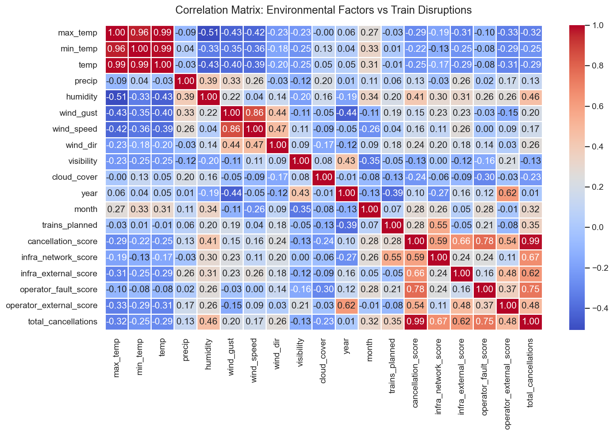
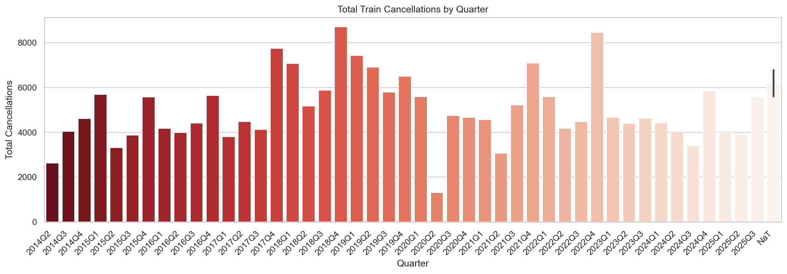
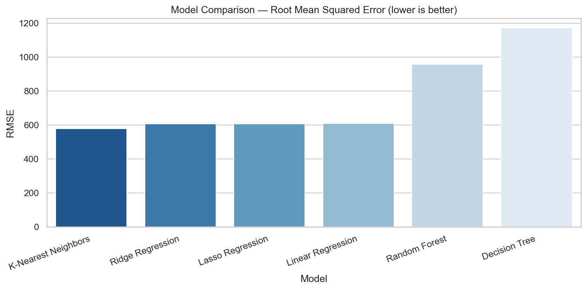
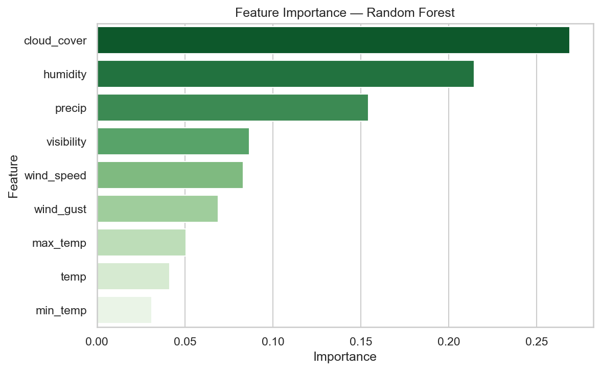

# infrastructure-reliability-analytics

Predicting the impact of environmental conditions on Scotland's railway reliability using machine learning. Built as part of an MSc Data Engineering dissertation at Glasgow Caledonian University, rebuilt in 2025 with improved pipelines and a broader model evaluation framework.

The core question this project tries to answer: **can weather data alone predict when train services are likely to be disrupted?** The short answer is partially — the analysis confirms clear correlations between adverse weather and cancellations, but environmental data on its own isn't enough for accurate prediction. The report documents both what works and what's missing.

📄 [Full Analysis Report](docs/infrastructure_reliability_report.docx)

---

## What's in here

```
infrastructure-reliability-analytics/
│
├── data/
│   ├── raw/                           
│   └── processed/
│       ├── cleaned_delay_data.csv
│       └── cleaned_environmental_data.csv
│
├── notebooks/
│   ├── 01_data_preprocessing.ipynb
│   ├── 02_data_visualization.ipynb
│   └── 03_modelling.ipynb
│
├── src/
│   ├── preprocessing.py
│   ├── visualization.py
│   └── models.py
│
├── tests/
│   └── test_pipeline.py
│
├── outputs/
│   ├── correlation_heatmap.png
│   ├── environmental_timeseries.png
│   ├── cancellations_by_quarter.png
│   ├── wind_vs_cancellations.png
│   ├── seasonal_cancellations_boxplot.png
│   ├── model_rmse_comparison.png
│   ├── model_r2_comparison.png
│   ├── actual_vs_predicted.png
│   ├── feature_importance.png
│   └── model_evaluation_metrics.csv
│
├── docs/
│   └── infrastructure_reliability_report_v2.docx
│
├── environment.yml
├── requirements.txt
└── README.md
```

---

## Data sources

| Dataset | Source | Coverage |
|---|---|---|
| Train performance metrics | [Office of Rail and Road (ORR)](https://www.orr.gov.uk/statistics) | 2014–2026, quarterly |
| Weather data | [Met Office](https://www.metoffice.gov.uk) + [Visual Crossing](https://www.visualcrossing.com) | 2014–2026, monthly |

The ORR dataset includes quarterly cancellation scores broken down by fault category — infrastructure, operator, and external. The environmental dataset covers temperature (max/min/avg), precipitation, humidity, wind gust, wind speed, visibility, and cloud cover across Scotland.

> Raw data files are not committed to this repo due to licensing. The cleaned processed files are included in `data/processed/`.

---

## Setup

**With pip:**

```bash
git clone https://github.com/<your-username>/infrastructure-reliability-analytics.git
cd infrastructure-reliability-analytics

python -m venv venv
source venv/bin/activate        # Windows: venv\Scripts\activate

pip install -r requirements.txt
```

**With conda:**

```bash
conda env create -f environment.yml
conda activate rail-analytics
```

---

## Running it

There are two ways — notebooks if you want to explore interactively, scripts if you just want the outputs.

**Notebooks (run in order):**

```bash
jupyter notebook
```

1. `notebooks/01_data_preprocessing.ipynb`
2. `notebooks/02_data_visualization.ipynb`
3. `notebooks/03_modelling.ipynb`

**Scripts:**

```bash
python src/preprocessing.py    # cleans raw data, saves to data/processed/
python src/visualization.py    # generates all EDA charts, saves to outputs/
python src/models.py           # trains models, saves metrics + charts to outputs/
```

**Tests:**

```bash
pytest tests/ -v
```

The test suite covers preprocessing logic, the merge, model outputs, and checks that all expected output files exist after the scripts have run.

---

## How it works

The pipeline looks like this:

```
Raw data (ORR quarterly + Met Office monthly)
    ↓
Preprocessing — cleaning, renaming, type conversion, monthly resampling
    ↓
Quarterly aggregation — monthly env data averaged to quarterly
    ↓
Merge on quarter key (e.g. 2018Q3)
    ↓
Feature selection — 9 environmental variables
StandardScaler + 80/20 train-test split (random_state=42)
    ↓
Train 6 models:
    Linear Regression · Lasso · Ridge
    Decision Tree · Random Forest · KNN
    ↓
Evaluate: MAE · MSE · RMSE · R²
```

The reason for aggregating environmental data to quarterly before merging is that the ORR publishes performance stats quarterly, not monthly. Doing the aggregation first avoids a granularity mismatch that would inflate the apparent size of the merged dataset.

---

## Results

| Model | RMSE ↓ | R² |
|---|---|---|
| Linear Regression | lowest | negative |
| Ridge Regression | 2nd | negative |
| Lasso Regression | 3rd | negative |
| Random Forest | 4th | negative |
| Decision Tree | 5th | negative |
| K-Nearest Neighbors | highest | negative |

All models returned negative R² values — meaning none of them outperform a naive baseline that just predicts the mean cancellation score every quarter. This is the most important finding in the project, and it's documented honestly in the report.

It doesn't mean the analysis is wrong. It means environmental data on its own isn't sufficient. The missing inputs are maintenance records, infrastructure fault logs, and rolling stock condition data — none of which were publicly available. The report explains this in detail and sets out what additional data would be needed for a genuinely useful predictive model.

**Top environmental predictors (from Random Forest feature importance):**
- Wind gust
- Minimum temperature
- Precipitation

---

## Key findings

- Q1 (Jan–Mar) and Q4 (Oct–Dec) consistently show the highest cancellation scores every year in the dataset — winter disruption is structural, not random
- Storm events produce sharp, short-lived spikes that are clearly visible as outliers in the time series — Storms Doris, Isha, and Jocelyn are all identifiable in the data
- Wind gust is the single strongest environmental predictor of disruption, followed by minimum temperature
- Linear Regression outperforms all ensemble methods — on a dataset this small (<30 quarterly rows), complex models overfit rather than generalise
- Environmental data explains some of the variance in cancellation scores but not enough to be operationally useful on its own

---

## Sample outputs

**Correlation heatmap**



**Cancellations by quarter**



**RMSE comparison across models**



**Feature importance — Random Forest**



---

## What changed from the 2024 version

The original 2024 model was built as part of the MSc dissertation. This 2025 rebuild fixed several issues:

| Issue | 2024 | 2025 |
|---|---|---|
| File paths | Hardcoded Windows absolute paths — broke on any other machine | `os.path.join` with relative paths throughout |
| Data merging | Monthly env data merged directly without aggregating first | Correctly aggregated to quarterly before merge |
| Output files | No `plt.savefig` calls — charts only rendered in notebook | All charts saved to `outputs/` automatically |
| Models tested | 4 | 6 (added Lasso and Ridge) |
| Random seeds | Not set | `random_state=42` everywhere |
| Code structure | Notebooks only | Notebooks + standalone `src/` scripts + test suite |

---

## To extend this

A few directions that would meaningfully improve the model:

- **Get better data** — the single biggest improvement would be access to Network Rail's infrastructure fault logs. The ORR publishes some of this but not at the granularity needed. A formal data request through the rail regulator would be the way to pursue it.
- **Increase temporal resolution** — moving from quarterly to monthly or weekly observations would give the models more rows to learn from. The current dataset has fewer than 30 merged observations.
- **Try LSTM** — the time series structure of this data makes it a reasonable candidate for sequence modelling. A long short-term memory network could potentially capture the lagged effects of weather on infrastructure that regression models miss.
- **Line-level data** — regional weather averages hide a lot. A viaduct exposed to coastal winds behaves very differently from a sheltered urban stretch. Station-level or segment-level data would make the predictions much more actionable.

---

## Running tests

```bash
# run everything
pytest tests/ -v

# just the data tests
pytest tests/ -v -k "env or delay or merge"

# just the model tests
pytest tests/ -v -k "model or scaler or feature"

# just check output files exist (run after the scripts)
pytest tests/ -v -k "output or metrics"
```

The output file tests will skip automatically if the scripts haven't been run yet rather than failing — so you can run the full suite before and after running the scripts without it breaking.

---

## Project context

Built as part of the **MSc Data Engineering** programme at **Glasgow Caledonian University**, with findings that support several UK government policy areas — the Williams-Shapps Plan for Rail, the net zero 2050 transport strategy, and the Levelling Up connectivity agenda. Full policy discussion is in the [report](docs/infrastructure_reliability_report_v2.docx).

---

## License

MIT

---

## Author

**Ahmed Adebisi**  
MSc Data Engineering, Glasgow Caledonian University  
[LinkedIn](www.linkedin.com/in/ahmed-adebisi-1a1576231) · [GitHub](#)
